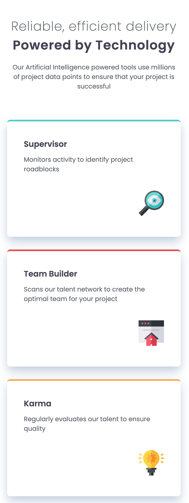

# Frontend Mentor - Four card feature section solution

This is a solution to the [Four card feature section challenge on Frontend Mentor](https://www.frontendmentor.io/challenges/four-card-feature-section-weK1eFYK). Frontend Mentor challenges help you improve your coding skills by building realistic projects.

## Table of contents

- [Overview](#overview)
  - [The challenge](#the-challenge)
  - [Screenshot](#screenshot)
  - [Links](#links)
- [My process](#my-process)
  - [Built with](#built-with)
  - [What I learned](#what-i-learned)

## Overview

### The challenge

Users should be able to:

- View the optimal layout for the site depending on their device's screen size

### Screenshot

### Links

- Solution URL: [https://github.com/nerdynischal/four-card-feature-section-master](https://github.com/nerdynischal/four-card-feature-section-master)
- Live Site URL: [https://nerdynischal.github.io/four-card-feature-section-master/](https://nerdynischal.github.io/four-card-feature-section-master/)

## My process

### Built with

- Semantic HTML5 markup
- CSS custom properties
- Scss
- Flexbox
- Mobile-first workflow

### What I learned

Using a mobile first apporach to build the design was a first since I normally worked the other way around. This was quite awkward at first but realised that it may actually lead to less code overall with more practice. Also, got more practice with writing sass.
